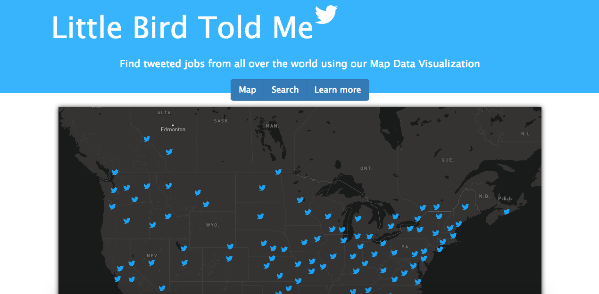

<h1>Data Dream Team Presents: Little Bird Told Me</h1>

<h3>Team Members</h3>
<ul>
  <li>Matt Kaiser</li>
  <li>Troy Kayne</li>
  <li>David Persico</li>
  <li>Amir Kashipazha</li>
</ul>

<h2>Frameworks, Tools, and Architecture</h2>
<ul>
  <li>GNIP Twitter API</li>
  <li>MongoDB</li>
  <li>Mapbox Studio API</li>
  <li>Nodejs + ExpressJS</li>
  <li>Docker</li>
  <li>Amazon Web Services</li>
</ul>

<h2>Project Vision</h2>

We are trying to stream large amounts of tweets and distribute them to CassandraDB, where we can make visualizations that correspond to current jobs that are out for hiring.

